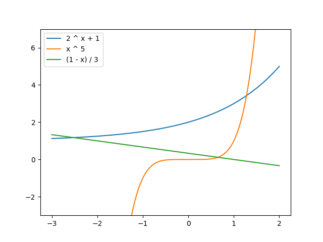

Постановка задачи

С заданной точностью ε вычислить площадь плоской фигуры, ограниченной тремя кривыми, уравнения которых
y = f1(x), y = f2(x) и y = f3(x) определяются вариантом задания.

При решении задачи необходимо:
  - с некоторой точностью eps1 вычислить абсциссы точек пересечения кривых, используя один из методов приближенного решения уравнения F(x)=0; отрезки, где программа будет искать точки пересечения и где применим ̆метод, определить вручную;
  - представить площадь заданной фигуры как алгебраическую сумму определенных интегралов и вычислить эти интегралы с некоторой точностью eps2 по квадратурной формуле (прямоугольников или трапеций).

Величины eps1 и eps2 подобрать вручную так, чтобы гарантировалось вычисление площади фигуры с точностью
ε = 0.001

